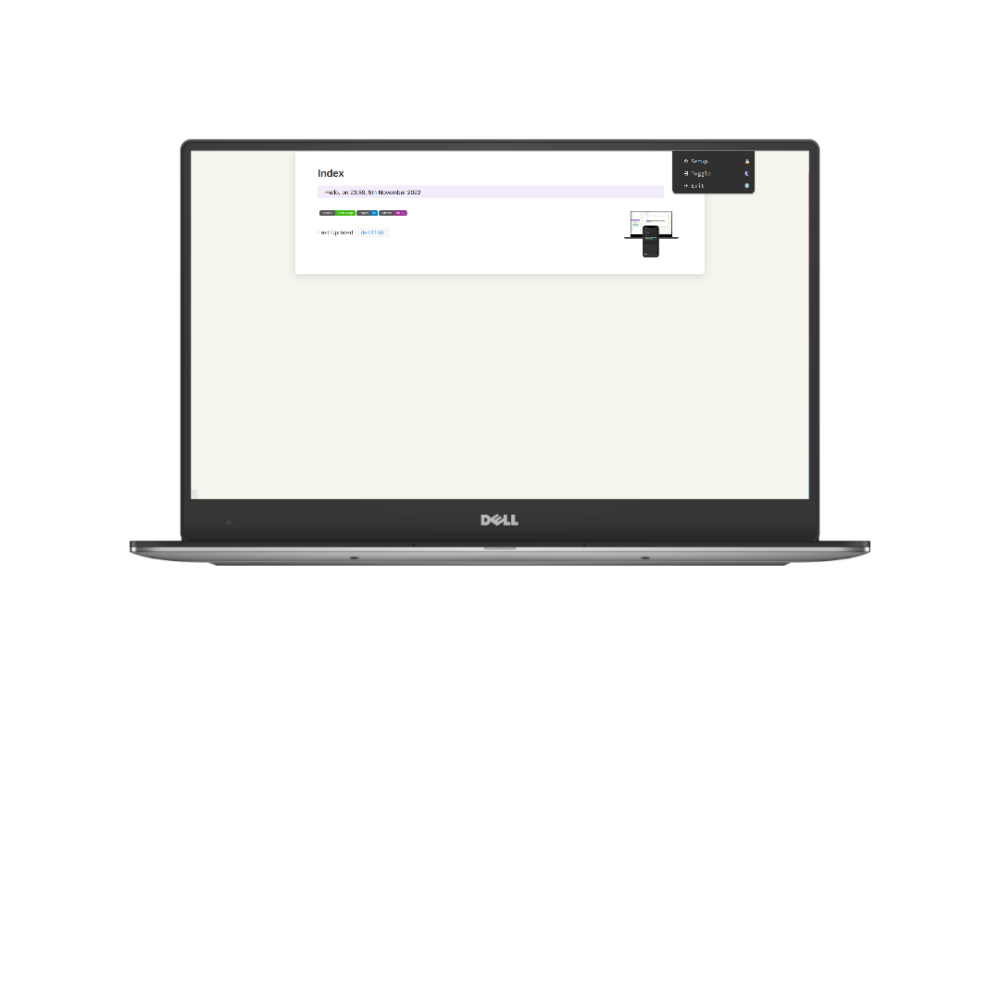

# TOC

<!-- toc -->

- [SHOWCASES](#showcases)
- [NOTICE](#notice)

<!-- tocstop -->

## SHOWCASES

## NOTICE

- install dpkg for deb
- use 19.0.0 (appimage require) or use nvm
- appimage generated need overwall
- https://www.electronjs.org/zh/docs/latest
- https://cloud.tencent.com/developer/article/1630792
